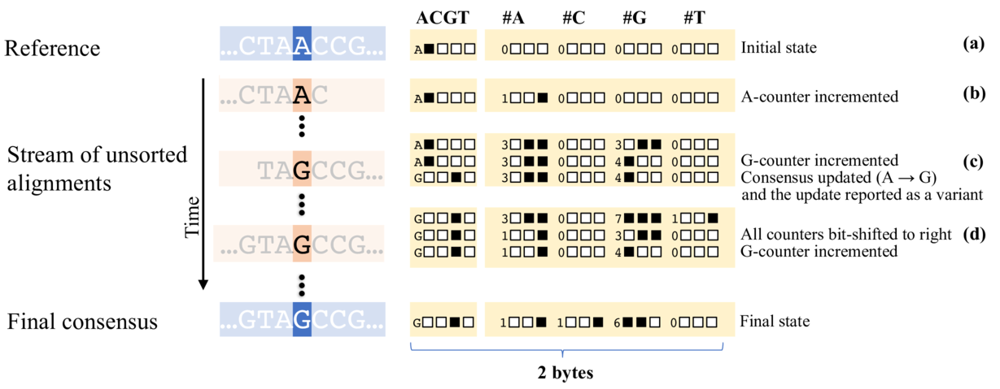

# OCOCO - the first online variant and consensus caller

[](https://travis-ci.org/karel-brinda/ococo)
[](https://arxiv.org/abs/1712.01146)
[](https://anaconda.org/bioconda/ococo)
[](https://doi.org/10.5281/zenodo.1066531)


## Abstract

**Motivation:** Identifying genomic variants is an essential step for connecting genotype and
phenotype. The usual approach consists of statistical inference of variants
from alignments of sequencing reads. State-of-the-art variant callers can
resolve a wide range of different variant types with high accuracy. However,
they require that all read alignments be available from the beginning of
variant calling and be sorted by coordinates. Sorting is computationally
expensive, both memory- and speed-wise, and the resulting pipelines suffer from
storing and retrieving large alignments files from external memory. Therefore,
there is interest in developing methods for resource-efficient variant calling.

**Results:** We present Ococo, the first program capable of inferring variants in a
real-time, as read alignments are fed in. Ococo inputs unsorted alignments from
a stream and infers single-nucleotide variants, together with a genomic
consensus, using statistics stored in compact several-bit counters. Ococo
provides a fast and memory-efficient alternative to the usual variant calling.
It is particularly advantageous when reads are sequenced or mapped
progressively, or when available computational resources are at a premium.

[](figures/Figure_1.pdf)


## Citation

> Brinda K, Boeva V, Kucherov G. **Ococo: an online variant and consensus
> caller.** arXiv:1712.01146 [q-bio.GN], 2018. https://arxiv.org/abs/1712.01146


## Quick example

```bash
git clone --recursive https://github.com/karel-brinda/ococo
cd ococo && make -j
./ococo -i test.bam -f test.fa --vcf-cons -
```

## Installation

### From Bioconda

```
conda install -c bioconda ococo
```

### Building from source

**Prerequisities**

* GCC 4.8+ or equivalent
* ZLib

**Compilation:** ``make``

**Installation:** ``make install``


## How to use

```NAME
SYNOPSIS
       ococo -i <SAM/BAM file> [other options]

DESCRIPTION
       Ococo  is a program to call genomic consensus directly from an unsorted
       SAM/BAM stream.

   Input options:
       -i, --input FILE
              Input SAM/BAM file (- for standard input).

       -f, --fasta-ref FILE
              Initial FASTA reference (otherwise seq of N's is used).

       -s, --stats-in FILE
              Input statistics.

   Output options:
       -F, --fasta-cons FILE FASTA file with consensus

       -S, --stats-out FILE
              Output statistics.

       -V, --vcf-cons FILE
              VCF file with updates of consensus (- for standard output)

       -P, --pileup FILE
              Truncated pileup (- for standard output).

       --verbose
              Verbose mode (report every update of a counter).

   Parameters for consensus calling:
       -x, --counters STR
              Counter configuration [ococo16].


              configuration   bits/counter   bits/position
              ococo16         3              16
              ococo32         7              32
              ococo64         15             64


       -m, --mode STR
              Mode [batch].


              mode        description
              real-time   updates reported immediately
              batch       updates reported after end of algn stream


       -q, --min-MQ INT
              Skip alignments with mapping quality smaller than INT [1].

       -Q, --min-BQ INT
              Skip bases with base quality smaller than INT [13].

       -w, --ref-weight INT
              Initial counter value for nucleotides from ref [0].

       -c, --min-cov INT
              Minimum coverage required for update [2].

       -M, --maj-thres FLOAT
              Majority threshold [0.51].
```


## Issues

Please use [Github issues](https://github.com/karel-brinda/ococo/issues).


## Changelog

See [Releases](https://github.com/karel-brinda/ococo/releases).


## Licence

[MIT](https://github.com/karel-brinda/ococo/blob/master/LICENSE)


## Author

[Karel Brinda](http://brinda.cz) \<kbrinda@hsph.harvard.edu\>


